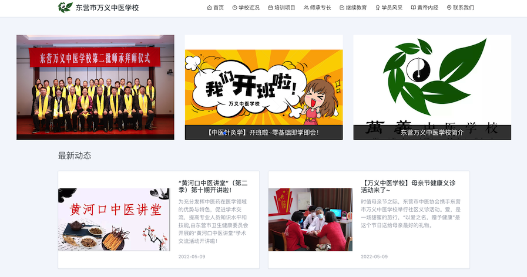

  

  <h1>万义中医研发团队介绍</h1>

积极探索智慧医疗垂直领域与通用化解决方案。

简体中文

# 产品概览

| [万义中医小程序](./images/QRCode/wyzy-qrcode.png) | 伶眸 | 中医体质辨识 |
| :----: | :----: | :----: |
|  |  |  |
| 一款中医常见病辅助诊断小程序 | 测试中 | 研发中 |

| [东营中医药网](https://www.dyzyxh.cn) | [万义中医学校官网](https://www.dyzyxh.cn/wyzyschool) | 万义中医数据中心 |
| :----: | :----: | :----: |
|  |  |  |
| 东营市中医协会官方网站 | 万义中医学校官方网站 | 团队数据治理平台 |

# 核心产品技术架构
## 万义中医小程序

| 系统架构 | 回春平台 | 灵犀平台 |
| :----: | :----: | :----: |
|  |  |  |
| 系统总体设计 | 通用化中医智能辨证系统(ISRS) | 数字医疗物料库 |
